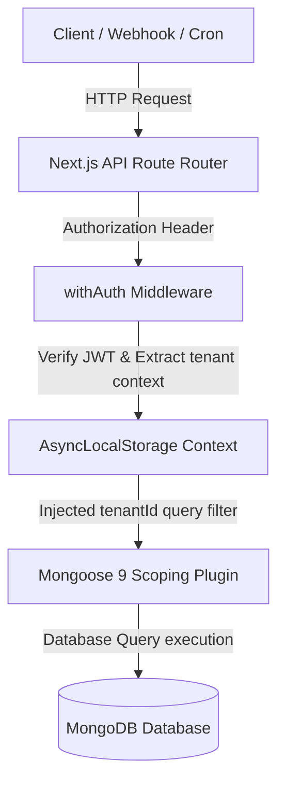

# SocietyOS

SocietyOS is a next-generation multi-tenant housing society management application built with Next.js 14, TypeScript, TailwindCSS, and MongoDB/Mongoose. It manages users, billing, Razorpay integration, complaints, and visitor logs securely across isolated society contexts.

---

## 1. System Architecture

SocietyOS uses a middleware and plugin-driven architecture to secure tenant boundaries at the database layer before queries execute.



---

## 2. What This Does Differently

This repository is built around strict security, reliability, and modern engineering practices. Here is what we do differently:

1. **Strict Multi-Tenancy Boundary via `AsyncLocalStorage` & Mongoose Plugin**
   * *The Problem:* Traditional systems rely on developers manually writing `.find({ societyId })` on every route. If a developer forgets the filter on a single endpoint, it causes a critical security leak.
   * *Our Solution:* SocietyOS interceptors dynamically capture the active tenant context using `AsyncLocalStorage` in the auth middleware. A custom Mongoose plugin (`scopingPlugin.ts`) intercepts queries and appends the scoping filter at runtime.
   * *No-Context Safety:* Any query executed without an active tenant context throws a runtime crash unless explicitly marked as unscoped (e.g., system jobs), preventing silent database leaks.

2. **Idempotent Razorpay Webhook Processing**
   * Webhook requests can be retried or duplicated by third-party APIs. We enforce idempotency at the database layer using unique indexes on event IDs (`razorpayEventId`). A duplicate webhook capture is caught, logged, and safely returns a no-op success without double-crediting bills or double-generating receipts.

3. **Offline-Tolerant Watchman Synchronizer**
   * When a watchman device goes offline, check-ins are logged locally. The sync endpoint accepts batched guest logs, processes each entry independently (a bad signature/expired token in one doesn't fail the rest), and preserves the original client capture timestamp (`entryTime`) instead of using the sync-request arrival time.

4. **Linear Complaint Status Pipeline**
   * Status transitions (`Open` &rarr; `In Progress` &rarr; `Resolved` &rarr; `Closed`) are validated server-side. Out-of-order changes (e.g., opening directly to closed) are rejected. Reopening a closed complaint automatically spawns a *new* linked complaint record rather than modifying the closed document, preserving audit trails.

5. **CI/CD-Gated Automated Deployments**
   * Hardened production stability via a GitHub Actions pipeline that boots a local MongoDB service container, runs ESLint, typechecking, and the full Jest integration test suite (89 tests). If any test fails, automated Vercel deployment is immediately aborted.

6. **Society Activation Safety Guards**
   * Enforces that a newly onboarded society is created as inactive by default. It cannot be marked active by a Super Admin until at least one emergency contact is configured by the society's Admin, eliminating empty contact screens for residents.

---

## 3. Environment Variables (.env.local)

To run the application locally, create a `.env.local` file in the root directory. Use the following template:

```env
# MongoDB Connection URI
MONGODB_URI=mongodb://localhost:27017/societyos

# JWT Configuration (for user authentication)
JWT_SECRET=your_jwt_secret_key_minimum_32_characters

# Cron Configuration (for daily late-fees job verification)
CRON_SECRET=your_cron_secret_key_minimum_32_characters

# Razorpay Configuration (for payment processing)
RAZORPAY_KEY_ID=rzp_test_your_key_id
RAZORPAY_KEY_SECRET=your_razorpay_secret_key
RAZORPAY_WEBHOOK_SECRET=your_razorpay_webhook_secret
```

---

## 4. Getting Started

### Prerequisites
- Node.js (v18 or v20)
- MongoDB installed locally or a running Atlas instance

### Step 1: Install Dependencies
```bash
npm install
```

### Step 2: Seed the Database
Seed the database with mock demo societies, users, units, bills, complaints, and visitor logs.
> **Note:** The seed script has built-in protection and will refuse to execute if your `MONGODB_URI` contains the word "test", ensuring safety against data corruption.
```bash
npm run seed
```

### Step 3: Run the Development Server
```bash
npm run dev
```
Open [http://localhost:3000](http://localhost:3000) in your browser to view the application.

---

## 5. Running the Test Suite

We use Jest for integration and tenant isolation tests.

To run all 89 tests:
```bash
npx jest --verbose --no-cache --forceExit
```

To run individual test files:
```bash
npx jest tests/integration/visitors.test.ts --verbose --no-cache --forceExit
```

---

## 6. Future Roadmap

As the platform scales beyond the initial MVP, the following architectural additions are planned:

1. **Multi-Role Accounts & Dynamic Context Switching**
   * *Problem:* Currently, a single email is unique across the entire user collection, and a user's role is immutable to prevent privilege escalation. However, in real life, a Society Admin or Super Admin may also live in the society as a Resident.
   * *Proposed Solution:* Refactor the `User` schema to decouple authentication (email/password) from authorization profiles. Users will be able to hold multiple roles (e.g., Admin + Resident) and dynamically switch their active context view from their profile menu, which will trigger a token refresh to update the active JWT scoping.
2. **Bulk Notice Broadcaster**
   * Support SMS/WhatsApp integration to broadcast critical notices to residents who might not regularly log in to the web portal.
3. **Advanced Visitor Analytics**
   * Visual charts for Society Admins showing peak visitor hours, delivery frequency, and unit-level visitor statistics for security planning.