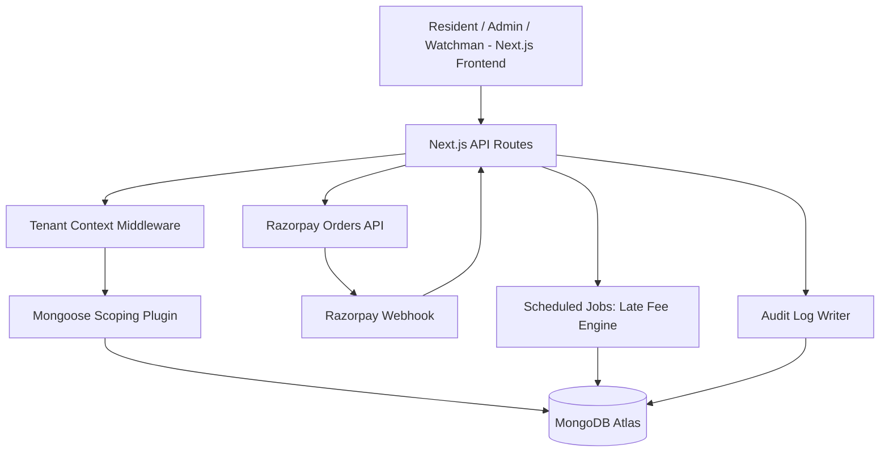
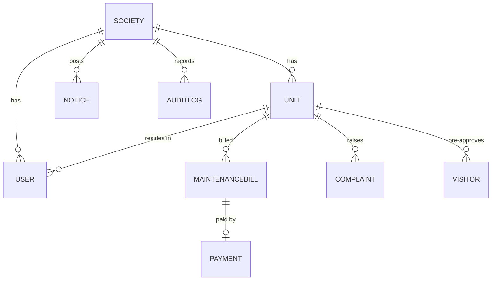
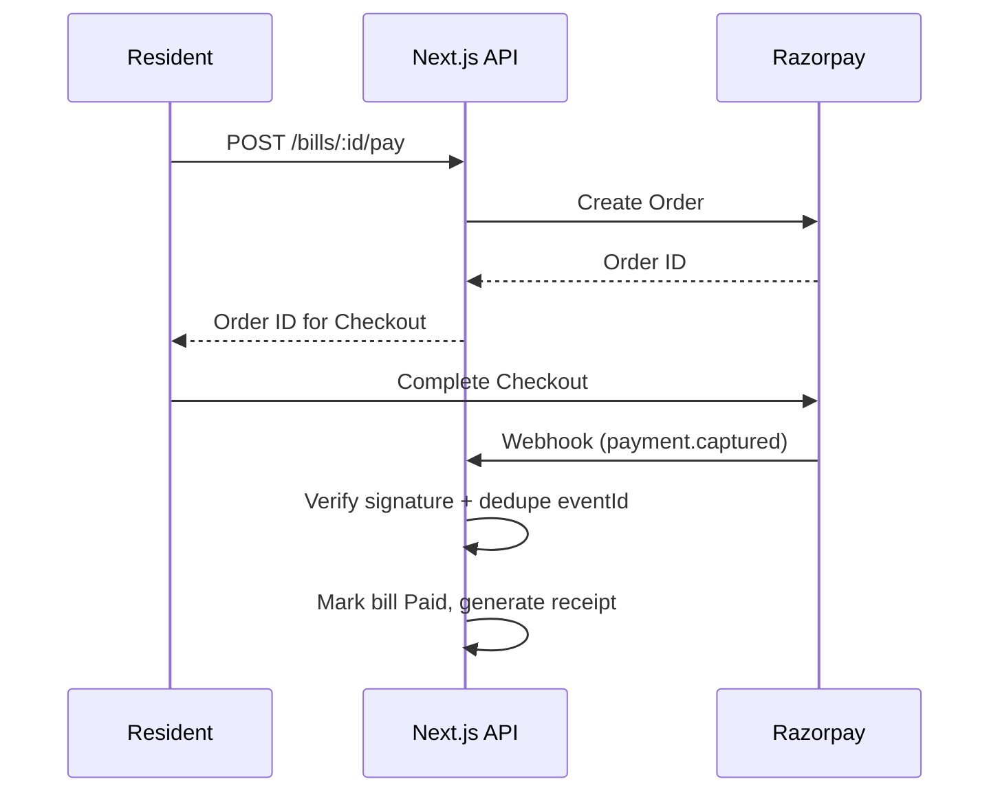
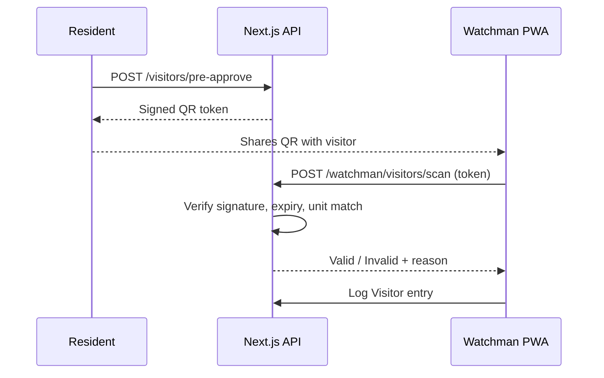
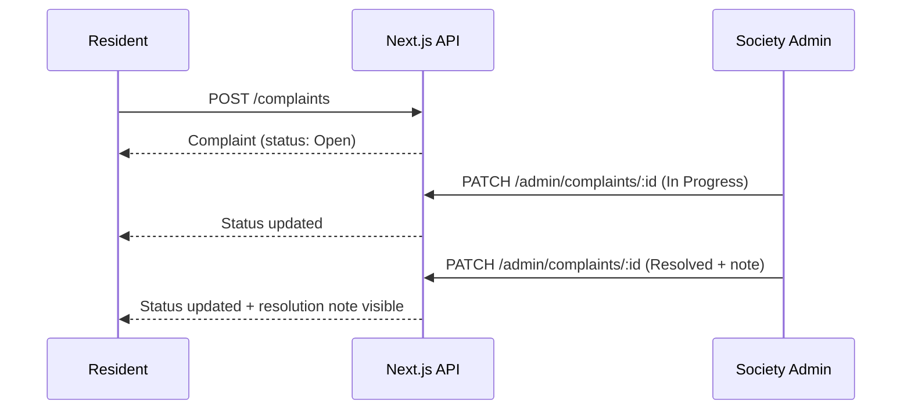

# Product Requirements Document

---

# 1. Executive Summary

SocietyOS is a production-grade, multi-tenant management platform for Indian residential housing societies, purpose-built for the co-operative housing society model common in Mumbai and other metro markets. It replaces the WhatsApp groups, paper visitor registers, and manual maintenance ledgers that the overwhelming majority of societies still rely on with a single system that handles billing, payments, complaints, visitor access, and notices for an entire building or complex.

Several open-source "society management" projects already exist on GitHub. Reviewed against SocietyOS's design goals, they share a consistent set of shortcomings: naive or absent tenant isolation (a `societyId` field checked ad hoc per route, rather than enforced at the data layer), untyped JavaScript codebases, server-rendered interfaces built on aging stacks (EJS, Bootstrap, jQuery), shallow or entirely absent payment integration, no visitor pre-approval workflow, no automated late-fee logic, no audit trail of administrative actions, and no CI-gated test suite. Several ship a `.github/workflows` folder that only deploys — it does not gate on tests passing.

SocietyOS's competitive advantage is not a longer feature list. It is that every one of those specific gaps is treated as a first-class requirement rather than an afterthought: tenant isolation is enforced by middleware and a Mongoose plugin so a missing filter in a new route cannot leak data across societies; payments run through Razorpay with idempotent webhook handling so a retried webhook cannot double-credit a bill; every administrative mutation is written to an audit log; and the CI pipeline blocks merges on failing tests, not just failing builds.

# 2. Product Vision

The long-term vision for SocietyOS is to become the default digital operating layer for co-operative housing societies in India — starting with a single building or society as the unit of adoption, and expanding horizontally across a city as adjacent societies see a neighbor's success. The target market is the estimated hundreds of thousands of registered co-operative housing societies across Indian metros, the large majority of which run entirely on manual or ad hoc digital processes (WhatsApp, Excel, paper registers) today.

Success in the near term looks like a single society fully onboarded — units, residents, and admin staff all actively using the platform for billing and visitor management for at least one full billing cycle without falling back to manual processes. Success in the long term looks like SocietyOS becoming the system of record a society's managing committee points to during audits, elections, and disputes, because its audit trail and financial records are more trustworthy than what preceded them.

# 3. Problem Statement

Existing society management tools, including the open-source projects surveyed during SocietyOS's design phase, share a set of structural limitations:

- **Single-tenant architecture.** Most existing projects assume one deployment per society, or bolt on a `societyId` field without enforcing isolation at the query layer — meaning a single coding mistake in any future feature can leak one society's resident data, bills, or complaints to another.
- **Poor security.** Authentication is frequently session-based with no token rotation, secrets are checked into example configs, and there is no rate limiting on login or payment endpoints.
- **Weak payment support.** Where payment integration exists at all, it is not built for the Indian market (Stripe rather than Razorpay), and webhook handlers are not idempotent — a retried webhook event can double-mark a bill as paid.
- **Lack of audit trails.** No existing surveyed project logs who changed what, when. This matters directly for co-operative societies, where billing disputes and managing-committee elections routinely turn into "who approved this" arguments.
- **No visitor QR workflows.** Visitor logging, where it exists, is a manual entry by a security guard with no resident-initiated pre-approval step.
- **Poor mobile usability.** Watchman-facing visitor logging is desktop-oriented in every surveyed project, despite being used almost exclusively at a gate on a phone or tablet with unreliable connectivity.
- **Lack of automated maintenance billing.** Late fees, where modeled at all, are calculated manually by an admin rather than derived automatically from a per-society rule.
- **Missing CI/testing.** Test suites are absent or minimal; where a CI workflow exists, it deploys without gating on tests.
- **Outdated tech stacks.** Server-rendered EJS/Bootstrap or early-model React with no type safety, making the codebase harder to extend safely and a weaker signal in a technical interview.

# 4. Goals

**Business goals**
- Reach one fully onboarded pilot society (all units + admin + watchman actively using the platform) within the first development cycle.
- Establish a reference architecture and audit trail credible enough to be shown to a managing committee as a system of record.

**Technical goals**
- Zero cross-tenant data leakage, verified by an automated test suite that specifically attempts to breach isolation.
- 100% of payment webhook events processed idempotently, verified by replay tests.
- CI pipeline blocks any merge where lint, typecheck, or tests fail.

**Product goals**
- Reduce the time an admin spends generating and tracking a monthly billing cycle from hours (manual ledger) to minutes.
- Give every resident a visitor pre-approval flow that does not require a phone call to the gate.

**Non-goals**
- SocietyOS does not aim to replace accounting/ERP software for the society's statutory financial filings in its first version.
- SocietyOS does not aim to support native mobile apps in the first version — the Watchman experience is a PWA, not a native app.
- SocietyOS does not aim to support facility booking, parking management, or intercom integration in the first version (see Future Roadmap).

# 5. Personas

### Resident
- **Goals:** Pay maintenance on time without visiting an office; raise and track complaints; let guests in without being physically present to call down to the gate.
- **Pain points:** No visibility into whether a bill has actually been received by the society; complaints raised verbally get lost; guests are turned away or let in without any record.
- **Primary workflows:** View and pay a maintenance bill, raise a complaint and track its status, generate a visitor pre-approval QR/link, view society notices.

### Society Admin
- **Goals:** Generate accurate bills for all units without manual spreadsheet work; know exactly who owes what and since when; resolve complaints without disputes over "who approved what."
- **Pain points:** Manual ledgers are error-prone and hard to audit; complaints tracked over WhatsApp have no accountability trail; late fees are inconsistently applied because they're calculated by hand.
- **Primary workflows:** Bulk-generate maintenance bills with a configurable late-fee rule, track payment status per unit, manage the complaint pipeline, post notices, review the audit log.

### Watchman
- **Goals:** Quickly verify whether a visitor is expected, without needing to call up to a flat; keep a reliable log even when the gate's internet connection is unreliable.
- **Pain points:** Paper registers are illegible and never reviewed; no way to confirm a visitor is actually expected without a phone call.
- **Primary workflows:** Scan a resident-issued visitor QR/link, log an unscheduled visitor manually against a unit, view who is currently inside.

### Platform Super Admin
- **Goals:** Onboard new societies quickly; monitor platform health across all tenants without being able to see any single society's resident-level data.
- **Pain points:** No existing tooling separates platform-level operations from society-level data access.
- **Primary workflows:** Create a new Society record and its first Admin user, view cross-society operational metrics (uptime, active societies, billing volume) without drilling into resident PII.

# 6. User Stories

**As a Resident**, I want to pay my maintenance bill online, so that I don't have to visit a society office or hand over cash.
*Acceptance criteria:* Resident sees current bill amount and due date; clicking Pay creates a Razorpay order; on successful payment, bill status updates to Paid and a receipt is available for download; a failed payment leaves the bill Unpaid with no partial state.

**As a Resident**, I want to raise a complaint and see its status change over time, so that I know it's being handled.
*Acceptance criteria:* Resident can create a complaint with a category and description; complaint appears with status Open; resident receives a visible status update when Admin changes it to In Progress, Resolved, or Closed; resident can view Admin's resolution note.

**As a Resident**, I want to pre-approve a visitor by generating a QR code or link, so that my guest doesn't need to be manually verified by phone.
*Acceptance criteria:* Resident enters visitor name and expected time window; system generates a unique QR/link tied to that Unit and time window; the code is single-use or expires after the window closes; Watchman scanning the code sees the visitor's name, the unit, and a valid/invalid state.

**As a Society Admin**, I want to generate maintenance bills for all units in one action, so that I don't have to create them one by one.
*Acceptance criteria:* Admin selects a billing period and amount (or per-unit override); system creates one MaintenanceBill per Unit in that Society; Admin can view a Society-wide status breakdown (paid/unpaid/overdue) immediately after generation.

**As a Society Admin**, I want overdue bills to accrue a late fee automatically according to a rule I configure, so that fee application is consistent.
*Acceptance criteria:* Admin sets a late-fee rule (percentage or flat, with a grace period) per Society; a scheduled job applies the fee to any bill past its due date exactly once; the applied fee is visible on the bill and reflected in the AuditLog.

**As a Society Admin**, I want to see an audit log of every administrative action taken on my Society's data, so that disputes can be resolved with evidence.
*Acceptance criteria:* Every bill edit, complaint status change, notice post, and visitor override is recorded with actor, timestamp, and before/after state; the log is append-only and filterable by date, actor, and entity type.

**As a Watchman**, I want to log a visitor even when the gate's connection drops, so that no entry goes unrecorded.
*Acceptance criteria:* Visitor entries created while offline are queued locally; queued entries sync automatically once connectivity returns; the Watchman sees a clear "pending sync" indicator for unsynced entries.

**As a Super Admin**, I want to onboard a new Society with its first Admin user in a single flow, so that new customers can start using the platform same-day.
*Acceptance criteria:* Super Admin creates a Society record, its first Unit set (or imports one), and an initial Admin account; the new Admin receives an activation link; Super Admin cannot subsequently view that Society's resident-level complaint or payment data through the platform-level view.

# 7. Functional Requirements

### Authentication
**Purpose:** Establish and verify user identity and role across all tenant boundaries.
**Requirements:** Email/password signup with an activation step for non-Super-Admin roles; JWT access tokens (short-lived) plus refresh tokens (longer-lived, revocable); logout revokes the refresh token.
**Business rules:** A Resident account must be approved by a Society Admin before activation; a Watchman account is created only by a Society Admin, never self-registered.
**Edge cases:** Refresh token reuse after revocation must be rejected and logged; concurrent logins from multiple devices are allowed but each device gets its own refresh token so one can be revoked independently.
**Validation rules:** Password minimum complexity enforced server-side, not just client-side; email format and uniqueness per Society (a resident email can exist in only one Society at a time in v1).
**Permissions:** Only Super Admin can create a Society Admin account directly; Society Admin can create Watchman accounts and approve Resident signups.
**Dependencies:** Society and User collections must exist before any auth flow can be tested end-to-end.

### Society Management
**Purpose:** Represent the tenant root that all other data is scoped beneath.
**Requirements:** CRUD for Society records, restricted to Super Admin; each Society has a configurable late-fee rule and emergency contact list.
**Business rules:** A Society cannot be deleted while it has any active Units with unresolved bills; deactivation (soft delete) is preferred over hard delete.
**Edge cases:** Renaming a Society must not break existing QR/visitor links tied to its Units.
**Validation rules:** Society name uniqueness is not enforced (two societies may share a name in different areas) but internal `societyId` must be unique.
**Permissions:** Super Admin only for creation/deactivation; Society Admin can edit their own Society's configuration (late-fee rule, emergency contacts).
**Dependencies:** None — this is the tenant root.

### Units
**Purpose:** Represent an individual flat/unit within a Society, the anchor for billing, residency, and visitor records.
**Requirements:** Admin can bulk-import units (e.g., via CSV) or add individually; each unit tracks its current resident(s) and billing history.
**Business rules:** A unit may have more than one resident account (e.g., owner and tenant) but only one is designated primary for billing notices.
**Edge cases:** A resident moving out must be unlinked from a unit without deleting their historical payment/complaint records.
**Validation rules:** Unit identifier unique within a Society.
**Permissions:** Society Admin manages units; Residents can view only their own unit.
**Dependencies:** Society must exist first.

### Residents
**Purpose:** Represent the primary end-user role, scoped to one unit within one Society.
**Requirements:** Resident profile, linked unit, payment history, complaint history, visitor pre-approvals.
**Business rules:** A resident signup request is Pending until a Society Admin approves it against a claimed unit.
**Edge cases:** Duplicate signup attempts against an already-occupied unit must be flagged to the Admin, not silently rejected or silently accepted.
**Validation rules:** Phone number format validated for SMS/WhatsApp reminder delivery in a future phase.
**Permissions:** Resident can only read/write their own data; cannot view other units' bills or complaints.
**Dependencies:** Units must exist.

### Maintenance Billing
**Purpose:** Generate and track periodic maintenance charges per unit.
**Requirements:** Bulk bill generation per billing period; configurable base amount (society-wide default with per-unit override, e.g., for larger units); status tracking (Unpaid, Paid, Overdue).
**Business rules:** A bill moves to Overdue automatically once its due date passes without full payment; late fee applies once, based on the Society's configured rule.
**Edge cases:** Partial payments are not supported in v1 — a bill is Paid only on full amount; if partial payment support is needed later, it is a new bill state, not an edit to Paid.
**Validation rules:** Bill amount must be positive; due date must be after generation date.
**Permissions:** Admin generates and edits bills (with audit logging); Resident can only view and pay their own unit's bills.
**Dependencies:** Units and the Society's late-fee rule.

### Payments
**Purpose:** Process resident payments against maintenance bills via Razorpay.
**Requirements:** Create a Razorpay order per bill payment attempt; verify payment via signed webhook; generate a downloadable receipt on success.
**Business rules:** A bill can only be paid once; a second payment attempt against an already-Paid bill must be blocked before an order is even created.
**Edge cases:** Webhook arrives before the frontend's client-side confirmation (race condition) — the webhook is the source of truth, not the client callback; a duplicate webhook for the same event ID must not create a duplicate Payment record.
**Validation rules:** Razorpay webhook signature must be verified before any state change; unverified webhooks are logged and discarded.
**Permissions:** Only the resident linked to a bill can initiate its payment; webhook endpoint is unauthenticated by user session but authenticated by Razorpay signature.
**Dependencies:** MaintenanceBill must exist and be Unpaid/Overdue.

### Complaints
**Purpose:** Track resident-reported issues through a defined resolution pipeline.
**Requirements:** Resident creates a complaint with category and description; Admin assigns, updates status, and closes with a resolution note.
**Business rules:** Status transitions are linear: Open → In Progress → Resolved → Closed (no skipping directly from Open to Closed without a resolution note).
**Edge cases:** A resident re-opening a Closed complaint should create a linked new complaint referencing the original, not mutate the closed record.
**Validation rules:** A resolution note is required before a complaint can move to Resolved.
**Permissions:** Resident can create and view own complaints; Admin can view/manage all complaints in their Society.
**Dependencies:** Units and Residents.

### Visitors
**Purpose:** Track who enters the premises, with or without pre-approval.
**Requirements:** Resident-generated pre-approval (QR/link) with a name and time window; Watchman manual entry for unscheduled visitors.
**Business rules:** A pre-approval code is valid only within its stated time window and only for the Unit that generated it.
**Edge cases:** A pre-approval code scanned twice within its window (e.g., visitor leaves and re-enters) should log a second Visitor entry, not error out, but should be visually distinguished as a re-entry.
**Validation rules:** Time window end must be after start; window cannot exceed a Society-configured maximum (e.g., 24 hours) to limit stale codes.
**Permissions:** Residents create pre-approvals for their own unit only; Watchman can view/scan any pre-approval within their Society.
**Dependencies:** Units.

### QR Check-in
**Purpose:** Provide the scan/verify mechanism Watchman uses against Resident-generated pre-approvals.
**Requirements:** QR encodes a signed token (not raw IDs) so it cannot be forged or guessed; scanning validates signature, expiry, and single/multi-use rule, then logs the Visitor entry.
**Business rules:** An expired or already-fully-used code shows a clear invalid state to the Watchman, with the reason (expired vs. wrong unit vs. already used).
**Edge cases:** Clock skew between the token's issued time and the scanning device must be tolerated within a small margin.
**Validation rules:** Token signature must be verified server-side even if the Watchman app is offline-queued — validation happens on sync, and the Watchman UI must clearly mark entries as "pending verification" until synced.
**Permissions:** Only Watchman role can perform a scan action.
**Dependencies:** Visitors module.

### Watchman Portal
**Purpose:** Mobile-first, offline-tolerant interface for gate staff.
**Requirements:** PWA with local queue (IndexedDB or equivalent) for entries made while offline; automatic sync on reconnect; live view of currently-inside visitors.
**Business rules:** An entry is not considered final until synced and server-validated; the local queue must never silently drop an entry.
**Edge cases:** Two Watchmen on different devices logging entries for the same gate simultaneously must not create sync conflicts that silently overwrite one entry with another — each entry is independent, not a shared mutable record.
**Validation rules:** Same as Visitors/QR Check-in modules, deferred until sync.
**Permissions:** Watchman role only.
**Dependencies:** Visitors, QR Check-in.

### Audit Logs
**Purpose:** Provide an immutable record of administrative actions for dispute resolution and trust.
**Requirements:** Every create/update/delete performed by an Admin (or Super Admin) role is recorded with actor, action, entity type/ID, before-state, after-state, and timestamp.
**Business rules:** Audit log entries are never edited or deleted, including by Super Admin.
**Edge cases:** Bulk actions (e.g., bulk bill generation) should log a single summarizing entry plus references to affected records, not one entry per unit, to avoid drowning the log.
**Validation rules:** N/A — this is a system-generated, read-only collection.
**Permissions:** Society Admin can view their own Society's log; Super Admin can view platform-level action logs but not resident-level Society data.
**Dependencies:** All mutating modules.

### Notices
**Purpose:** Broadcast Society-wide announcements.
**Requirements:** Admin creates a notice with title, body, optional expiry date; Residents see active notices on their dashboard.
**Business rules:** Expired notices are hidden from the Resident view but retained for the Admin's history.
**Edge cases:** A notice edited after posting should show a "last edited" marker to avoid disputes about what was originally communicated.
**Validation rules:** Title and body required; expiry date, if set, must be after posting date.
**Permissions:** Admin creates/edits; all Residents in the Society can read.
**Dependencies:** Society.

### Emergency Contacts
**Purpose:** Give residents fast access to Society-specific emergency numbers.
**Requirements:** Admin maintains a list (e.g., security, fire, plumber on-call); visible to all Residents.
**Business rules:** At least one contact is required per Society before it can be marked "active" for resident use.
**Edge cases:** N/A — this is a simple reference list.
**Validation rules:** Phone number format validated.
**Permissions:** Admin manages; Residents read-only.
**Dependencies:** Society.

### Analytics Dashboard
**Purpose:** Give Admin and Super Admin visibility into operational health.
**Requirements:** Admin view: collection rate, overdue total, open complaints by category. Super Admin view: active societies, aggregate billing volume, uptime — with no resident-level drill-down.
**Business rules:** Super Admin's dashboard must be built from aggregated queries that never expose individual resident or complaint records.
**Edge cases:** A newly onboarded Society with no billing history yet should show an empty/zero state, not an error.
**Validation rules:** N/A.
**Permissions:** Admin sees own Society only; Super Admin sees cross-Society aggregates only.
**Dependencies:** Billing, Payments, Complaints.

### Admin Settings
**Purpose:** Let a Society Admin configure Society-specific rules.
**Requirements:** Late-fee rule (percentage/flat, grace period), default bill amount, visitor pre-approval max window.
**Business rules:** Changing the late-fee rule affects only future billing cycles, never retroactively recalculates past bills.
**Edge cases:** N/A.
**Validation rules:** Percentage between 0–100; grace period non-negative.
**Permissions:** Society Admin only.
**Dependencies:** Society.

# 8. Multi-Tenant Architecture

Tenant isolation is the technical centerpiece of SocietyOS and the single biggest differentiator from the surveyed open-source alternatives, none of which enforce it structurally.

**Tenant Isolation & societyId.** Every tenant-scoped collection (Unit, User [non-Super-Admin], MaintenanceBill, Payment, Complaint, Visitor, Notice, AuditLog) carries a `societyId` field referencing the Society. This field is never optional and never mutable after creation.

**Automatic query scoping.** Rather than trusting each route handler to remember to filter by `societyId`, a Mongoose plugin is attached to every tenant-scoped schema. The plugin hooks into `find`, `findOne`, `findOneAndUpdate`, `updateMany`, `deleteOne`, and `countDocuments` and injects a `societyId` filter sourced from the request's authenticated context (via `AsyncLocalStorage` or an equivalent request-scoped context, not a globally mutable variable). A query executed with no `societyId` in context (e.g., a background job) must explicitly opt into an "unscoped" mode — this makes cross-tenant access an explicit, auditable decision rather than an accidental default.

**Middleware.** An Express/Next.js middleware layer extracts `societyId` and `role` from the verified JWT on every authenticated request and populates the request-scoped context before any handler or database call executes. Requests without a valid `societyId` in context are rejected for any role other than Super Admin.

**JWT context.** The JWT payload includes `userId`, `role`, and `societyId` (null for Super Admin). Tokens are short-lived; refresh tokens are stored server-side (hashed) so they can be individually revoked.

**Compound indexes.** Every tenant-scoped collection has a compound index on `{ societyId, _id }` at minimum, plus additional compound indexes matching common query patterns (e.g., `{ societyId, unitId }` on MaintenanceBill).

**Cross-tenant testing.** The test suite includes a dedicated isolation test file that: creates two Societies with overlapping data shapes, authenticates as a user in Society A, and asserts that every list/read endpoint returns zero results and every direct-ID-access endpoint returns 404 (not 403, to avoid confirming record existence) when targeting Society B's data.

**Data ownership & tenant lifecycle.** A Society's data is owned entirely by that Society; Super Admin's platform-level views are built exclusively from aggregation pipelines that never surface individual documents.

**Deletion strategy.** Society deletion is soft (an `active: false` flag) in v1. Hard deletion, if ever implemented, must cascade through every tenant-scoped collection in a single transaction or queued job, and is out of scope for the initial build.

# 9. Database Design

**Society** — Purpose: tenant root. Relationships: parent of all tenant-scoped collections. Indexes: unique index on internal ID. Constraints: cannot be hard-deleted while active Units exist. Validation: name required. Lifecycle: created by Super Admin, soft-deleted (deactivated) rather than removed.

**User** — Purpose: represents all human actors (Resident, Society Admin, Watchman, Super Admin). Relationships: belongs to one Society (null for Super Admin); Resident additionally references a Unit. Indexes: compound `{ societyId, email }` unique. Constraints: role is immutable after creation (a role change requires a new account, not an edit, to avoid privilege-escalation bugs). Validation: email format, password hash never returned in any API response. Lifecycle: created, optionally deactivated; never hard-deleted while it has payment or complaint history.

**Unit** — Purpose: represents a flat. Relationships: belongs to one Society; has zero or more linked Residents; has many MaintenanceBills. Indexes: compound `{ societyId, unitNumber }` unique. Constraints: unitNumber unique within a Society. Validation: unitNumber required. Lifecycle: created at Society onboarding or added later by Admin; deactivated rather than deleted if it has billing history.

**MaintenanceBill** — Purpose: represents one billing-period charge for one unit. Relationships: belongs to a Society and a Unit; has zero or one Payment. Indexes: compound `{ societyId, unitId, billingPeriod }` unique (prevents duplicate bill generation for the same period). Constraints: amount positive; dueDate after generation date. Validation: status enum (Unpaid, Paid, Overdue). Lifecycle: generated in bulk by Admin, transitions Unpaid → Overdue → Paid (or Unpaid → Paid directly), never deleted (financial record).

**Payment** — Purpose: represents a Razorpay payment attempt/result against a bill. Relationships: belongs to a MaintenanceBill; belongs to a Society (denormalized for query scoping). Indexes: unique index on Razorpay `eventId` to enforce webhook idempotency; compound `{ societyId, billId }`. Constraints: one successful Payment per bill. Validation: status enum (Created, Success, Failed). Lifecycle: created on order initiation, finalized by webhook, never deleted.

**Complaint** — Purpose: tracks a resident-reported issue. Relationships: belongs to a Society, a Unit, and the Resident who raised it; optionally assigned to an Admin. Indexes: compound `{ societyId, status }` for admin dashboards. Constraints: resolution note required before Resolved status. Validation: category enum, status enum. Lifecycle: Open → In Progress → Resolved → Closed; never deleted (historical record); reopening creates a new linked Complaint.

**Visitor** — Purpose: records a gate entry, pre-approved or manual. Relationships: belongs to a Society and a Unit; optionally references a pre-approval token record. Indexes: compound `{ societyId, unitId, entryTime }`. Constraints: entryTime required; exitTime, if present, after entryTime. Validation: pre-approval token, if present, must pass signature/expiry check before the entry is marked verified. Lifecycle: created by Watchman (online or queued offline then synced), never edited after creation except to add exitTime.

**Notice** — Purpose: Society-wide announcement. Relationships: belongs to a Society; authored by an Admin. Indexes: compound `{ societyId, expiryDate }`. Constraints: expiryDate after postedDate if present. Validation: title and body required. Lifecycle: created, optionally edited (with an edit history marker), naturally hidden from residents after expiry but retained.

**AuditLog** — Purpose: immutable record of administrative mutations. Relationships: references the Society, the actor User, and the affected entity type/ID. Indexes: compound `{ societyId, timestamp }`, `{ societyId, actorId }`. Constraints: no update or delete operations permitted at the application layer (enforced by omitting update/delete routes entirely, not just by convention). Validation: action type enum. Lifecycle: append-only, retained indefinitely.

# 10. API Requirements

**Authentication APIs**
- `POST /api/auth/signup` — Request: email, password, role-specific fields (Resident includes claimed unit). Response: 201 with pending-approval status for Residents, or account object for Admin-created Watchman. Errors: 409 on duplicate email within Society. Authorization: public endpoint (rate-limited). Validation: password complexity, email format.
- `POST /api/auth/login` — Request: email, password. Response: access token + refresh token. Errors: 401 on invalid credentials (generic message, no user-enumeration hints). Authorization: public, rate-limited per IP and per email.
- `POST /api/auth/refresh` — Request: refresh token. Response: new access token (+ rotated refresh token). Errors: 401 if revoked or expired. Authorization: valid refresh token required.
- `POST /api/auth/logout` — Revokes the presented refresh token. Authorization: authenticated.

**Resident APIs**
- `GET /api/bills` — Response: current resident's unit's bills. Authorization: Resident role, scoped to own unit.
- `POST /api/bills/:id/pay` — Creates a Razorpay order. Errors: 409 if bill already Paid. Authorization: Resident must own the bill's unit.
- `POST /api/complaints`, `GET /api/complaints` — Create/list own complaints. Authorization: Resident scoped to own records.
- `POST /api/visitors/pre-approve` — Generates a signed QR/link token. Validation: time window within Society-configured max. Authorization: Resident, own unit only.

**Admin APIs**
- `POST /api/admin/bills/generate` — Bulk-generates bills for a billing period. Request: period, base amount, optional per-unit overrides. Errors: 409 if bills already exist for that period. Authorization: Society Admin.
- `PATCH /api/admin/complaints/:id` — Updates status/assignment/resolution note. Validation: resolution note required for Resolved transition. Authorization: Society Admin, own Society only.
- `GET /api/admin/audit-log` — Filterable read of the Society's audit log. Authorization: Society Admin, own Society only.

**Watchman APIs**
- `POST /api/watchman/visitors/scan` — Validates a pre-approval token and logs entry. Errors: distinguishes expired / wrong-unit / already-used states in the response body. Authorization: Watchman role.
- `POST /api/watchman/visitors/manual` — Logs an unscheduled visitor. Authorization: Watchman role.
- `POST /api/watchman/sync` — Batch-submits queued offline entries; each entry independently validated and timestamped with its original client-side capture time, not the sync time.

**Payment APIs**
- `POST /api/payments/order` — Creates a Razorpay order for a bill (also reachable via the bill-pay endpoint above; documented separately for the payment module's own error handling). Errors: 409 if bill not in a payable state.

**Webhook APIs**
- `POST /api/webhooks/razorpay` — Verifies Razorpay signature; processes `payment.captured` and `payment.failed` events; deduplicates on Razorpay `eventId`. Response: 200 regardless of business outcome (per Razorpay's retry semantics), with internal error logging on failure. Authorization: signature-verified, not session-authenticated.

# 11. Payment System

Payments use Razorpay's Orders API. A Resident-initiated payment first creates an Order server-side (never client-side, to avoid amount tampering), then the client completes payment via Razorpay Checkout. The webhook — not the client-side success callback — is the authoritative source of truth for marking a bill Paid, because the client callback can be lost to a closed browser tab or network drop after payment succeeds.

**Webhook verification.** Every incoming webhook's signature is verified against the Razorpay webhook secret before any data is read from its payload. Unverified requests are logged and discarded with no further processing.

**Idempotency / duplicate prevention.** The Razorpay event ID is stored as a unique index on the Payment collection. A webhook retry for an already-processed event ID is a no-op — the handler checks for the existing record before writing.

**Receipt generation.** On a verified `payment.captured` event, a receipt (PDF or structured record) is generated and linked to the Payment record, downloadable by the Resident who owns the bill.

**Late fee automation.** A scheduled job (daily) queries all Unpaid bills past their due date within each Society, applies that Society's configured late-fee rule exactly once (tracked via a `lateFeeApplied` flag on the bill, not by recalculating from scratch each run), and writes an AuditLog entry summarizing the batch.

**Failure handling.** A `payment.failed` webhook leaves the bill in its prior state (Unpaid/Overdue) — it does not create a false Paid state, and the Resident sees a clear "payment failed, try again" state rather than silence.

**Refund considerations.** Refunds are out of scope for v1's automated flow; a manual refund process (Admin-initiated, logged in AuditLog) is the fallback, with automated refund API integration deferred to a future phase.

# 12. Security

**JWT & Refresh Tokens.** Access tokens are short-lived (e.g., 15 minutes); refresh tokens are longer-lived, stored hashed server-side, and rotated on each use (rotation detects token replay — reuse of an already-rotated token revokes the entire token family).

**RBAC.** Role is embedded in the JWT and re-verified server-side on every request against the database record, not trusted solely from the token, to allow immediate effect of role/deactivation changes.

**Password hashing.** bcrypt or argon2, never a reversible scheme; no plaintext password ever logged.

**Rate limiting.** Applied per-IP and per-account on login, signup, and payment-order-creation endpoints to blunt credential stuffing and payment abuse.

**CSRF.** Mitigated via same-site cookies where cookies are used, or via token-in-header patterns for the JWT-based API design; webhook endpoints are exempted from CSRF protection but rely on signature verification instead.

**XSS.** All user-generated content (complaint descriptions, notice bodies) is escaped on render; no `dangerouslySetInnerHTML`-equivalent rendering of unsanitized user input.

**Input validation.** Every API route validates its request body against a schema (e.g., Zod) before touching the database.

**Audit logs.** As described in section 7/9 — immutable, append-only.

**Secrets management.** Razorpay keys, JWT signing secrets, and database credentials are never committed to the repository; they are provided via environment variables and a `.env.example` with placeholder values only. This is treated as a strict requirement given how common accidental key exposure is in fresher-built portfolio projects.

**Tenant isolation.** As described in section 8 — the primary security boundary of the whole system.

**Logging & monitoring.** Structured application logs exclude PII and secrets by default; a separate audit log (section 9) is the system of record for who-did-what.

**Data encryption.** Data at rest via MongoDB Atlas's built-in encryption; data in transit via TLS everywhere, including from the Watchman PWA to the API.

# 13. Non-Functional Requirements

**Performance:** Bulk bill generation for a mid-sized society (≤500 units) completes within a few seconds; API read endpoints scoped to a single society respond well within typical user-perceived thresholds given the compound indexes described in section 9.
**Availability:** Deployed on Vercel + MongoDB Atlas, both offering managed high availability; no single self-hosted point of failure in v1.
**Scalability:** Multi-tenant design scales horizontally by Society count without schema changes; MongoDB Atlas scales storage/compute independently of the application tier.
**Reliability:** Idempotent webhook handling and offline-queue sync (section 7, Watchman Portal) are the two reliability-critical paths and are the most heavily tested.
**Maintainability:** Full TypeScript strict mode; consistent module boundaries per section 7's functional breakdown.
**Accessibility:** Core Resident and Admin flows meet basic WCAG AA expectations (contrast, keyboard navigation, form labeling) — a full accessibility audit is deferred to a later phase.
**Observability:** Structured logs plus basic uptime/error monitoring; the Analytics Dashboard (section 7) doubles as an internal health signal for Admin.
**Localization:** English-only in v1; the data model (e.g., Notice, Complaint category labels) is structured to allow future Hindi/Marathi localization without schema changes.
**Mobile responsiveness:** Resident and Admin views are responsive; Watchman view is mobile-first by design, not an afterthought.
**Offline support / PWA:** Scoped specifically to the Watchman portal (section 7) — Resident and Admin views assume connectivity.

# 14. Testing Strategy

**Unit testing:** Jest for business logic — late-fee calculation, bill status transitions, QR token signing/verification — isolated from the database where possible.
**Integration testing:** Supertest against API routes with a test database, covering the full request/response cycle including auth middleware.
**API testing:** Every endpoint in section 10 has at least one happy-path and one authorization-failure test.
**Tenant isolation tests:** A dedicated suite (section 8) that actively attempts cross-tenant reads/writes and asserts failure.
**Payment tests:** Webhook signature verification (valid/invalid), idempotency (replayed event ID), and failure-path (payment.failed leaves bill unpaid).
**Webhook tests:** Specifically simulate out-of-order delivery (webhook before client callback) and duplicate delivery.
**E2E tests:** Key Resident (pay a bill), Admin (generate bills, resolve a complaint), and Watchman (scan a valid and an expired QR) flows, run against a seeded test environment.
**Performance tests:** Bulk bill generation and Society-scoped list endpoints benchmarked against the seeded demo dataset (section 15/17).
**Security tests:** Rate-limit enforcement, JWT tampering rejection, and refresh-token-reuse detection.
**CI requirements:** Every pull request runs lint, typecheck, and the full test suite; merges are blocked on any failure. A separate deploy workflow runs only after the test workflow succeeds on `main`.

# 15. Tech Stack

**Frontend:**
Next.js 14 App Router
TypeScript
TailwindCSS

**Backend:**
Next.js API Routes

**Database:**
MongoDB Atlas
Mongoose

**Authentication:**
JWT
Refresh Tokens

**Payments:**
Razorpay

**Testing:**
Jest
Supertest
React Testing Library

**CI:**
GitHub Actions

**Deployment:**
Vercel
MongoDB Atlas

# 16. Repository Structure

```
societyos/
├── src/
│   ├── app/                     # Next.js App Router routes (pages + layouts)
│   │   ├── (resident)/          # Resident-facing route group
│   │   ├── (admin)/             # Society Admin route group
│   │   ├── (watchman)/          # Watchman PWA route group
│   │   ├── (super-admin)/       # Platform-level route group
│   │   └── api/                 # API route handlers, mirroring section 10
│   ├── lib/
│   │   ├── auth/                # JWT signing/verification, refresh rotation
│   │   ├── tenant/               # Request-scoped context + Mongoose scoping plugin
│   │   ├── payments/             # Razorpay client, webhook verification, idempotency
│   │   └── validation/            # Zod schemas per module
│   ├── models/                   # Mongoose schemas, one file per collection (section 9)
│   ├── jobs/                     # Scheduled jobs (late-fee engine)
│   ├── components/               # Shared React components
│   └── styles/                   # Tailwind config and global styles
├── tests/
│   ├── unit/
│   ├── integration/
│   ├── tenant-isolation/          # Dedicated cross-tenant breach tests
│   └── e2e/
├── scripts/
│   └── seed.ts                   # Demo data seed script (section 17)
├── .github/workflows/
│   ├── ci.yml                    # lint + typecheck + test, runs on every PR
│   └── deploy.yml                # runs only after ci.yml succeeds on main
├── .env.example
└── README.md
```

Each folder exists to keep a specific concern isolated: `lib/tenant` is separated from `models` because the scoping plugin must be reusable across every schema without duplicating logic; `tests/tenant-isolation` is separated from general `integration` tests because it is the single most important test suite in the project and should never be lost among general coverage; `jobs` is separated from `api` because scheduled tasks run outside the request/response cycle and must not implicitly rely on request-scoped tenant context.

# 17. Development Phases

**Phase 1 — Authentication, Tenant Isolation**
*Deliverables:* Auth APIs, JWT/refresh flow, request-scoped tenant context, Mongoose scoping plugin, tenant-isolation test suite.
*Acceptance criteria:* A user in Society A cannot read or write any Society B data through any endpoint; refresh token rotation and reuse-detection tests pass.
*Risks:* Getting the scoping plugin wrong here undermines every later phase — this phase should not be rushed.
*Dependencies:* None.

**Phase 2 — Society, Users, Units**
*Deliverables:* Society/Unit CRUD, Resident signup + Admin approval flow, Watchman account creation.
*Acceptance criteria:* Admin can onboard a Society with units and approve resident signups end-to-end.
*Risks:* Bulk unit import edge cases (duplicate unit numbers).
*Dependencies:* Phase 1.

**Phase 3 — Billing, Payments**
*Deliverables:* Bulk bill generation, Razorpay order creation, idempotent webhook handler, receipt generation, late-fee scheduled job.
*Acceptance criteria:* Replayed webhook events do not double-process; late fee applies exactly once per overdue bill.
*Risks:* Race condition between client callback and webhook — must default to webhook as source of truth.
*Dependencies:* Phase 2.

**Phase 4 — Complaints**
*Deliverables:* Complaint creation, status pipeline, Admin resolution flow.
*Acceptance criteria:* Status transitions enforce the Open → In Progress → Resolved → Closed order; resolution note required before Resolved.
*Risks:* Low — this is the most conventional CRUD module.
*Dependencies:* Phase 2.

**Phase 5 — Visitors, QR, Watchman**
*Deliverables:* Visitor pre-approval token generation, QR scan verification, offline-tolerant Watchman PWA with local queue and sync.
*Acceptance criteria:* Entries logged offline sync correctly on reconnect with original capture timestamps preserved; expired/invalid tokens show a clear reason.
*Risks:* Offline queue conflict handling; this phase has the most novel engineering work in the project.
*Dependencies:* Phase 2.

**Phase 6 — Audit Logs, Notices, Cron Jobs**
*Deliverables:* AuditLog writes wired into every mutating route from earlier phases, Notice CRUD, consolidation of the late-fee cron job.
*Acceptance criteria:* Every mutating Admin action from Phases 2–5 produces a corresponding AuditLog entry.
*Risks:* Retrofitting audit logging into earlier phases' routes if not planned for from Phase 1 — recommend stubbing the AuditLog write call from Phase 2 onward rather than deferring entirely.
*Dependencies:* Phases 2–5.

**Phase 7 — Testing, CI/CD, Deployment**
*Deliverables:* Full test suite consolidation, GitHub Actions CI (lint/typecheck/test gate) and deploy workflow, seed script, README with architecture diagram.
*Acceptance criteria:* CI blocks a merge with a deliberately broken test; deploy workflow only triggers after CI passes on main.
*Risks:* Low, but this phase is frequently skipped or rushed in comparable portfolio projects — it is treated here as a first-class phase, not cleanup.
*Dependencies:* All prior phases.

# 18. Success Metrics

**Product metrics:** Percentage of bills paid online vs. manually; average time from complaint creation to Resolved status; percentage of visitors entering via pre-approved QR vs. manual log.
**Engineering metrics:** Test coverage on tenant-isolation and payment-idempotency suites specifically (tracked separately from overall coverage); CI pass rate on first push.
**Business metrics:** Number of active societies onboarded; billing volume processed through Razorpay.
**Adoption metrics:** Percentage of a society's units with at least one active Resident account within 30 days of onboarding.

# 19. Future Roadmap

Native Android App; iOS App; WhatsApp Notifications; SMS reminders; full accounting/ledger export; parking management; facility booking; intercom integration; AI-assisted complaint categorization; predictive maintenance scheduling; resident marketplace; vendor management; OCR-based bill uploads; UPI AutoPay for recurring maintenance; face-recognition gate entry; IoT gate hardware integration; digital society elections/voting.

# 20. Appendix

**Architecture diagram (Mermaid)**


**ER diagram (Mermaid)**


**Sequence diagram — Resident paying maintenance**


**Sequence diagram — Visitor QR check-in**


**Sequence diagram — Complaint workflow**

